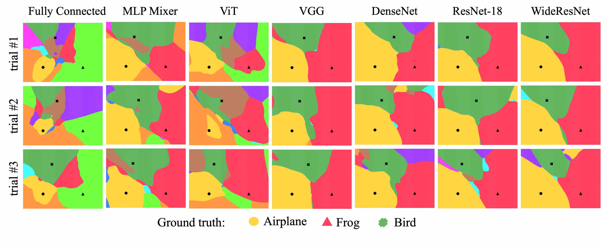

# Can Neural Nets Learn the Same Model Twice? Investigating Reproducibility and Double Descent from the Decision Boundary Perspective
To appear in CVPR 2022. 

<span style="color:blue">Repo is WIP, will add complete set of instructions by end of April.</span>




## Requirements

We recommend using `anaconda` or `miniconda` for python. Our code has been tested with `python=3.8` on linux.

Create a conda environment from the yml file and activate it.
```
conda env create -f environment.yml
conda activate dbviz_env
```

Make sure the following requirements are met

* torch>=1.8.1
* torchvision>=0.9.1

We used wandb to log most of the outputs.
```
conda install -c conda-forge wandb 
```

## Training the model and plotting the decision boundary

We provide wide variety of models, please see models folder to see the exhasutive list. Train the model with following command.
```
python main.py --net <model_name> --set_seed <init_seed> --save_net <model_save_path> --imgs 500,5000,1600 --resolution 500 --active_log --epochs <number_epochs> --lr <suitable_learningrate>
```


## Reproducibility experiments
Once you have a saved model, we save prediction arrays for this model by running the following command: 
```
python save_preds.py --load_net /path/to/your/saved/models --epochs 500 --resolution 50
```
Here, epochs is a stand-in for number of runs, and resolution determines the grid resolution for sampling. 

Then, we calculate the reproducibility matrix by running the following command: 

```
python calculate_iou.py --load_net /path/to/your/saved/models 
```

These two scripts also contain more information about the structure of saved models that is needed. 

To recreate the plots from the paper, first train each architecture atleast 3 times with different initilaization seed (like 0,1,2). Then run the following bash file.
```
bash script_plots.sh
```

## Double Descent experiments
To reproduce double descent experiments, please refer to the README file in the double-descent folder.

## Acknowledgements

We would like to thank the following public repos from which we borrowed model training utilites.
- https://github.com/kuangliu/pytorch-cifar
- https://github.com/lucidrains/vit-pytorch

## License
This repository is released under the Apache 2.0 license as found in the [LICENSE](LICENSE) file.

## Cite us

```
@article{somepalli2022can,
  title={Can Neural Nets Learn the Same Model Twice? Investigating Reproducibility and Double Descent from the Decision Boundary Perspective},
  author={Somepalli, Gowthami and Fowl, Liam and Bansal, Arpit and Yeh-Chiang, Ping and Dar, Yehuda and Baraniuk, Richard and Goldblum, Micah and Goldstein, Tom},
  journal={arXiv preprint arXiv:2203.08124},
  year={2022}
}

```